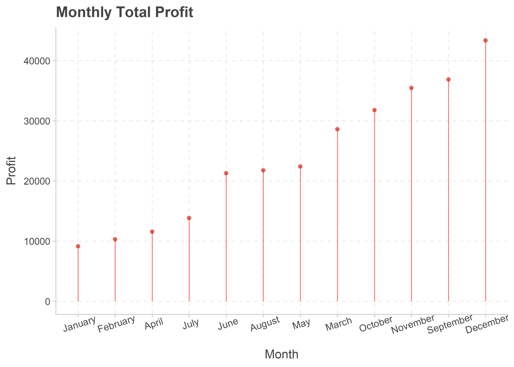
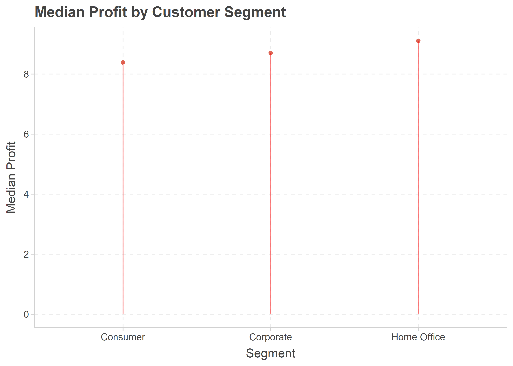
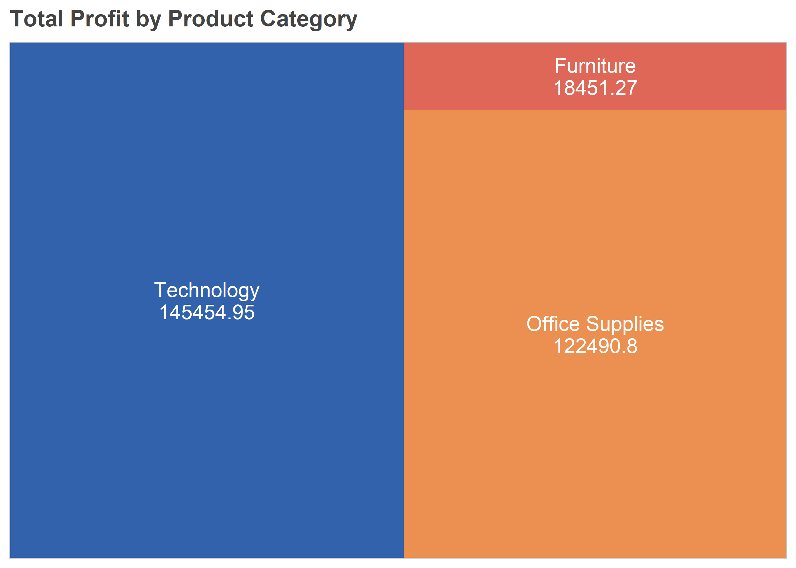
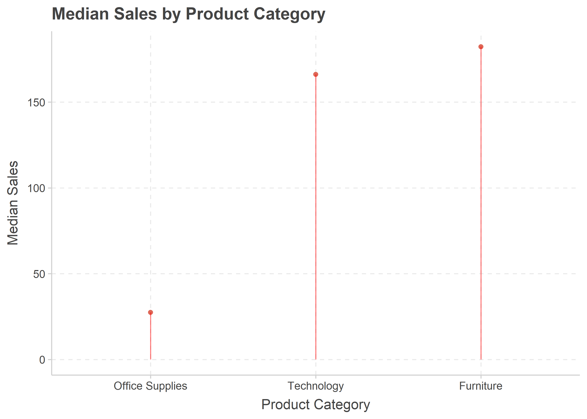
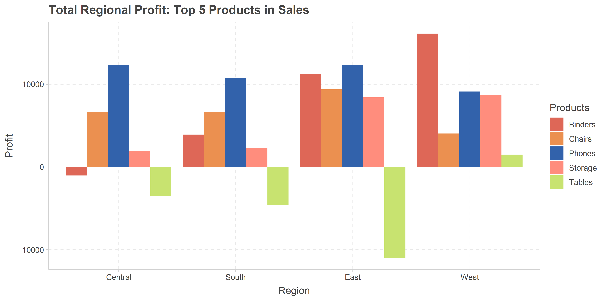

Store Analysis
================
By Erik Cheekes

-   [1 Introduction](#1-introduction)
-   [2 Preliminary Examination](#2-preliminary-examination)
-   [3 Univariate Analysis](#3-univariate-analysis)
    -   [3.1 Quantitative](#31-quantitative)
        -   [3.1.1 Profit](#311-profit)
        -   [3.1.2 Sales](#312-sales)
        -   [3.1.3 Quantity](#313-quantity)
    -   [3.2 Date](#32-date)
    -   [3.3 Qualitative](#33-qualitative)
        -   [3.3.1 Ship Mode](#331-ship-mode)
        -   [3.3.2 Customers](#332-customers)
        -   [3.3.3 Types of Product](#333-types-of-product)
        -   [3.3.4 Location](#334-location)
        -   [3.3.5 Discount](#335-discount)
-   [4 Bivariate Analysis](#4-bivariate-analysis)
    -   [4.1 Are transactions with higher sales more
        profitable?](#41-are-transactions-with-higher-sales-more-profitable)
    -   [4.2 How has total profit and total sales changed over
        time?](#42-how-has-total-profit-and-total-sales-changed-over-time)
    -   [4.3 How has profit and sales differed for customer
        segments?](#43-how-has-profit-and-sales-differed-for-customer-segments)
    -   [4.4 Which individual customers generated the most profit and
        sales?](#44-which-individual-customers-generated-the-most-profit-and-sales)
    -   [4.5 How has profit and sales differed for product
        categories?](#45-how-has-profit-and-sales-differed-for-product-categories)
    -   [4.6 How has profit and sales differed for product
        subcategories?](#46-how-has-profit-and-sales-differed-for-product-subcategories)
    -   [4.7 How has total profit differed by
        location?](#47-how-has-total-profit-differed-by-location)
        -   [4.7.1 Region](#471-region)
        -   [4.7.2 State](#472-state)
    -   [4.8 How has total sales differed by
        location?](#48-how-has-total-sales-differed-by-location)
        -   [4.8.1 Region](#481-region)
        -   [4.8.2 State](#482-state)
    -   [4.9 Do profit or sales differ in location by customer
        segment?](#49-do-profit-or-sales-differ-in-location-by-customer-segment)
        -   [4.9.1 Region (Profit)](#491-region-profit)
        -   [4.9.2 State (Profit)](#492-state-profit)
        -   [4.9.3 Region (Sales)](#493-region-sales)
        -   [4.9.4 State (Sales)](#494-state-sales)
    -   [4.10 Do profit or sales differ in location by product
        type?](#410-do-profit-or-sales-differ-in-location-by-product-type)
        -   [4.10.1 Categories (Profit)](#4101-categories-profit)
        -   [4.10.2 Subcategories (Profit)](#4102-subcategories-profit)
        -   [4.10.3 Categories (Sales)](#4103-categories-sales)
        -   [4.10.4 Subcategories (Sales)](#4104-subcategories-sales)
    -   [4.11 Do certain customer segments make more transactions for
        particular product
        categories?](#411-do-certain-customer-segments-make-more-transactions-for-particular-product-categories)
    -   [4.12 Is there a link between shipment choice and average profit
        or
        sales?](#412-is-there-a-link-between-shipment-choice-and-average-profit-or-sales)
    -   [4.13 Are discounts associated with more profits and sales on
        average?](#413-are-discounts-associated-with-more-profits-and-sales-on-average)
    -   [4.14 Do higher quantity transactions bring more profit or sales
        on
        average?](#414-do-higher-quantity-transactions-bring-more-profit-or-sales-on-average)
-   [5 Conclusion](#5-conclusion)
-   [6 Future Recommendation](#6-future-recommendation)

# 1 Introduction

This is a hypothetical case study conducted on a pubic dataset which can
be viewed and downloaded
[here](https://www.kaggle.com/datasets/vivek468/superstore-dataset-final).
In this hypothetical scenario, the owners of a store have collected data
on their sales, products, and customers over several years. The data is
unexplored and the store’s owners want it analysed to provide an
overview of their business. In particular, the owners want to focus
attention on how sales and profit vary. Further, they wish to know if
the data indicates any potential future strategies that may improve the
store’s profit. These specific requests can be satisfied by conducting
an EDA (exploratory data analysis) which involves exploring a dataset to
identify trends and patterns. EDA generally splits into two key steps:

1.  Univariate analysis (or descriptive statistics).
    -   Involves analysing and summarising each variable individually
        using statistical measures and visualisations.
    -   Identifies any potential data issues or errors to fix.
    -   Provides the initial information on the dataset which is needed
        to progress the analysis towards answering interesting and
        relevant questions.
2.  Bivariate or multivariate analysis (though the term bivariate
    analysis will be used to refer to both).
    -   Involves analysing two or more variables together to understand
        their potential relationships with each other.
    -   Requires asking the right questions of the data to uncover
        relevant and desired insights. In this case, such insights
        should satisfy the store owners’ requests.
    -   The previous step means the analyst knows what combinations of
        variables are needed to answer key questions and also the
        appropriate analysis methods to use.

# 2 Preliminary Examination

Before conducting any analysis, a necessary preliminary step involves
examining the data to check for any errors in the data that need
cleaning. Data cleaning refers to fixing or removing incorrect,
corrupted, incorrectly formatted, duplicate, or incomplete data. These
issues may make analysis impossible or invalidate findings. Below gives
a glimpse into the store’s data.

    ## Rows: 9,994
    ## Columns: 21
    ## $ Row.ID        <int> 1, 2, 3, 4, 5, 6, 7, 8, 9, 10, 11, 12, 13, 14, 15, 16, 1~
    ## $ Order.ID      <chr> "CA-2016-152156", "CA-2016-152156", "CA-2016-138688", "U~
    ## $ Order.Date    <chr> "11/08/2016", "11/08/2016", "06/12/2016", "10/11/2015", ~
    ## $ Ship.Date     <chr> "11/11/2016", "11/11/2016", "6/16/2016", "10/18/2015", "~
    ## $ Ship.Mode     <chr> "Second Class", "Second Class", "Second Class", "Standar~
    ## $ Customer.ID   <chr> "CG-12520", "CG-12520", "DV-13045", "SO-20335", "SO-2033~
    ## $ Customer.Name <chr> "Claire Gute", "Claire Gute", "Darrin Van Huff", "Sean O~
    ## $ Segment       <chr> "Consumer", "Consumer", "Corporate", "Consumer", "Consum~
    ## $ Country       <chr> "United States", "United States", "United States", "Unit~
    ## $ City          <chr> "Henderson", "Henderson", "Los Angeles", "Fort Lauderdal~
    ## $ State         <chr> "Kentucky", "Kentucky", "California", "Florida", "Florid~
    ## $ Postal.Code   <int> 42420, 42420, 90036, 33311, 33311, 90032, 90032, 90032, ~
    ## $ Region        <chr> "South", "South", "West", "South", "South", "West", "Wes~
    ## $ Product.ID    <chr> "FUR-BO-10001798", "FUR-CH-10000454", "OFF-LA-10000240",~
    ## $ Category      <chr> "Furniture", "Furniture", "Office Supplies", "Furniture"~
    ## $ Sub.Category  <chr> "Bookcases", "Chairs", "Labels", "Tables", "Storage", "F~
    ## $ Product.Name  <chr> "Bush Somerset Collection Bookcase", "Hon Deluxe Fabric ~
    ## $ Sales         <dbl> 261.9600, 731.9400, 14.6200, 957.5775, 22.3680, 48.8600,~
    ## $ Quantity      <int> 2, 3, 2, 5, 2, 7, 4, 6, 3, 5, 9, 4, 3, 3, 5, 3, 6, 2, 2,~
    ## $ Discount      <dbl> 0.00, 0.00, 0.00, 0.45, 0.20, 0.00, 0.00, 0.20, 0.20, 0.~
    ## $ Profit        <dbl> 41.9136, 219.5820, 6.8714, -383.0310, 2.5164, 14.1694, 1~

The data contains 21 columns (or variables) and 9,994 transactions. Also
visible are data types for each variable, which include qualitative
(e.g., a place name or type of product, this is also commonly known as
categorical data) and quantitative (i.e., discrete or continuous
numbers).

Below documents the cleaning process:

-   Order.Date and Ship.Date are incorrectly classed as categorical data
    when it should be date type. These two variables are converted into
    their appropriate date type.
-   Potential duplicate transactions and trailing whitespace are
    automatically checked and removed (if they exist).
-   Categorical variables have no incorrect duplicates (for example, an
    incorrect duplicate would be if a state shows up twice due to
    instances of incorrect spelling.
-   All postal codes have the correct number of digits.
-   Order.Date always precedes Ship.Date (it would be illogical if a
    shipment date preceded the customer making a purchase).
-   No missing values exist.
-   The country variable is removed as its only value is the United
    States.

# 3 Univariate Analysis

This section splits the analysis into three subsections which contain
the quantitative, qualitative, and date variables respectively.

## 3.1 Quantitative

Profit, Sales, and Quantity are the quantitative variables in the
dataset. While Row.ID is a quantitative variable analysis excludes it as
it gives no direct insight into the store’s operations.

### 3.1.1 Profit

Overall, the store generated $286,397 (US currency) in profit. The table
below statistically summarises the profit variable.

-   As the median is far lower than the mean, this indicates that there
    are some transactions with relatively extremely high profit values
    that are raising the mean (in statistic terms, there is a positive
    skew). Consequently, the median is a more accurate and robust
    measure of a transaction’s average profit as extreme values
    influence it less.

-   Due to the positive skew, the Interquartile range (IQR) is more
    appropriate for describing the variation of profit across the
    transactions than the standard deviation (labelled as ‘Std’ in the
    table). The IQR for profit is $27.64 which indicates that 50% of all
    transactions generated profit between $1.73 (the first quartile) and
    $29.36 (the third quartile).

-   The minimum value (-6,599.98) is the first indication of losses
    occurring.

-   The mode highlights that most transactions only broke even.

The graph below visualises the profit variable’s distribution. Note,
this graph only contains values above -$400 and below $400 to create a
clearer view of the majority of transactions. The excluded values only
account for roughly 2% of all transactions.

<!-- -->

-   The positive skewness of the profit variable is apparent as more
    transactions trail to the graph’s right than its left (i.e., more
    transactions exist with relatively higher profits than those with
    relatively high losses).
-   The number of transactions that showed losses are clearly indicated.
    In total, roughly 19% of transactions (or 1871) experienced a loss.

### 3.1.2 Sales

In total the store made $2,297,201 in sales. The below table presents
summary statistics for the sales variable.

-   Like profit, though more extreme, the mean is far higher than the
    median indicating transactions with very high sales are affecting
    the mean. Hence, the median is more appropriate measure of average
    sales.
-   The IQR show that 50% of all transactions made sales between the
    $17.28) and third $209.94.
-   The most common sales value was $12.96.
-   The maximum value reinforces the interpretation that extremely high
    sales values are influencing the averages.

The graph below visualises the sales variable. Only transactions under
$2000 are included so a clearer view of the sales variable’s
distribution can occur. The excluded values only account for roughly 1%
of all transactions.

<!-- -->

-   Most transactions are under $400 in sales (roughly 85%) while the
    majority are below $1000 (roughly \\95%).
-   The positive skewness of the sales variable is clear, that is, most
    values clustered together in the left portion of the graph and
    higher values trails to the right.

### 3.1.3 Quantity

The below table presents summary statistics for the quantity variable.

-   The averages for quantity are relatively similar as the median and
    mode are identical while the mean is slightly higher.
-   The standard deviation indicates, on average, item quantities in
    each transaction vary around the mean by 2.23.
-   The IQR shows 50% of transactions bought items in quantities of 2,
    3, 4, or 5.
-   No transaction contained over 14 items.

The graph below visualises the quantity variable.

<!-- -->

-   The quantity variable is bi-modal as 2 occurs almost as frequently
    as 3 (the latter only having 7 more transactions).
-   Quantities above 9 occur far less frequently (roughly only 2% of all
    transactions).
-   A small positive skew in the quantity variable is clearly visible,
    as most values cluster to the left portion of the graph and higher
    values become far less frequent as one moves right.

## 3.2 Date

Two variables, Order.Date and Ship.Date, refer to time. The dataset
stretches between January 2014 and January 2018. The two graphs below
visualise the amount of observations for each variable per day.

<!-- -->

-   Both variables show transactions increasing as time goes on.
-   Transactions tend to be higher during later months in each year
    which indicates a seasonal pattern in customer purchases.
-   The largest amount of orders (38) occurred in 2016-09-05.
-   The largest amount of shipments (35) occurred in 2015-12-16.

## 3.3 Qualitative

A number of qualitative variables exist in the store dataset that
provide information on shipment choices, customers, types of products,
location, and discount rates.

### 3.3.1 Ship Mode

The below visualisation is called a treemap and the size of each
rectangle represents the percentage or proportion of each category in
the variable. The treemaps used in this analysis also depict the actual
count for each category. For example, 5968 is the number of transactions
that used standard class.

<!-- -->

-   Standard class is the most commonly chosen ship mode.
-   Standard class has more far more transactions than the other two
    options combined (roughly 48% more).

The table below shows the specific percentages for each shipment option.

### 3.3.2 Customers

There are three variables relating to customers, these are, customer ID,
customer name, and segment. As customer ID and customer name refer to
the same individuals only analysing one is necessary.

There are 793 unique customer IDs which means (when considering the
total dataset contains 9994 transactions), many repeat customers exist.
The below table identifies customers who made the most transactions.

The number of transactions for each customer can also be summarized as
quantitative data, which the table below shows.

-   The three averages (mean, median, and mode) are relatively similar
    which indicates a normal distribution (i.e., a bell shape).

-   The standard deviation indicates, on average, that the number of
    transactions each customer made varied by 6.24 either side of the
    mean (12.60).

-   The IQR shows that 50% of customers made between 8-16 transactions.

-   The most common amount of transactions a customer made was 10.

The below graph visualises the number of transactions from the store’s
customers which shows a normal distribution with a slight poitive skew.

<!-- -->

The segment variable labels customers as either consumer, corporate, or
home office. The below graph visualises the amount of transactions for
each customer segment.

<!-- -->

-   The consumer segment contributes the most transactions, more than
    corporate and home office combined (by roughly 8%).
-   Corporate customers are responsible for roughly 70% more
    transactions than home office customers.
-   Consumer customers are responsible for roughly 71% more transactions
    than corporate customers.

The below table give specific percentages for each customer segment.

### 3.3.3 Types of Product

In total, the store’s products split into three broad categories of
office supplies, furniture, and technology. The graph below visualises
the amount of transactions for each product category.

<!-- -->

-   Office supplies are in far more transactions than technology or
    furniture products.
-   Even when combined, office supplies are in more transactions than
    the other categories (by roughly 52%).
-   Furniture products are in roughly 15% more transactions than
    technology products.

The below table gives specific percentages of transactions for each
product category.

Additionally, the product categories split into 17 smaller
subcategories. The graph below visualises the amount of transactions for
each subcategory.

<!-- -->

-   Only 2 subcategories have over 1000 transactions (binders and
    paper).
-   While 6 subcategories have between 500 and 1000 transactions.
-   Most subcategories (9) have under 500 transactions.

The table below offers exact numbers and percentages for each
subcategory.

The store sells 1850 uniquely named items. However, all items
individually contribute a small number of transactions. For example,
only three products contribute over 0.20% of all transactions in the
dataset.

Consequently, later analysis regarding products will only consider them
at the category and subcategory levels which can reveal meaningful
relationships with other variables.

### 3.3.4 Location

Several variables represent locations in the dataset, these include,
postal code, city, state, region, and country (as previously mentioned,
the latter was removed from the dataset).

There are 631 unique postal codes. The table below shows the top 10
postal codes that contributed the most transactions.

The number of transactions for each postal code can be summarised as
quantitative data as the table below shows.

-   The mean being far higher than the median indicates certain postal
    codes contributed a relatively high amount of transactions.
-   The mode indicates most postal codes only made a single transaction.
-   The IQR shows that 50% of postal codes made between 3 to 14
    transactions.

The below graph visualises the amount of transactions by postal code
which reinforces the interpretation of the summary statistics seen
above.

<!-- -->

-   Postal codes with more transactions are less common.
-   Very few postal codes made over 50 transactions (less than 1%).

There are 531 unique cities. The table below shows the top 10 cities
that made the most transactions.

The number of transactions for each city can also be summarised as
quantitative data as the table below shows.

-   A clear positive skew is present due to the mean being higher than
    the median which indicates certain cities contributed a
    disproportionately large number of transactions.
-   The mode shows that most cities made only one transaction.
-   The IQR shows that 50% of cities provide between 2.5 to 12
    transactions.

The below graph visualises transactions by city which reinforce the
interpretation of the summary statistics seen above.

<!-- -->

-   There are several cities with extremely high amounts of
    transactions.
-   Very few cities have over 50 transactions (under 1%).

Moving onto region, the graph below visualises the amount of
transactions in each.

<!-- -->

-   The western region of the United States made the most transactions,
    followed by eastern, central, and southern.
-   The western region made roughly double the amount of transactions
    than the southern region.

The table below identifies the specific percentages of transactions that
come from each region.

Information on each state is also available, however, this variable is
only visualised below as the resultant table would be cumbersome to use.

<!-- -->

-   Clear disparities exist in the number of transactions for the state.
-   Only 5 states have over 500 transactions.
-   California brings the most transactions by far (contributing a
    whopping 20% of all transactions).
-   Most states made under 400 transactions (42)

### 3.3.5 Discount

In total, excluding no discount, 11 unique discount rates (given in
decimals) exist ranging from 0.1 to 0.8 (or as is described, 10% to
80%). For the purpose of analysis, these discount rates are treated as
categories. The graph below visualises the discount variable and orders
them by quantity of transactions.

<!-- -->

-   No discount is the most common category (roughly 48% of all
    transactions).
-   Of the discounts, 20% is the most frequently placed on the products
    (roughly 37% of all transactions).

The table below specifies the percentage of transactions with each
discount rate.

# 4 Bivariate Analysis

This section analyses combinations of variables together to explore
their possible relationships and correlations. As per the owners’
request, how profit and sales relate to the other variables is of key
focus interest. The median is used when considering average profit or
sales. As explained in the previous section, the median is a more
accurate measure of the average transaction’s profit and sales than the
mean.

## 4.1 Are transactions with higher sales more profitable?

The below scatterplot graph visualises the relationship between sales
and profit. The trendline clearly indicates a positive correlation where
profit appears to increase as sales rise.

<!-- -->

A Pearson correlation coefficient was computed to formally assess the
relationship between sales and profit.

    ## [1] 0.4790643

A moderate positive correlation (r = .48) was found between sales and
profit. Therefore, transactions with higher sales tend to also have
higher profits. Interestingly, this also highlights many instances of
transactions with high sales that, for some reason, bring a profit loss.

## 4.2 How has total profit and total sales changed over time?

As order dates signify when a customer actually pays the store, it is
used to examine profit and sales overtime (as opposed to shipment
dates). Area chart graphs are constructed to visualise the yearly trends
for these two variables.

<!-- -->

-   Yearly profits consistently increase from 2014 to 2017.
-   Average (mean) yearly increase is $14,631.77.
-   2017 was roughly 90% more profitable than 2014 (total difference
    between the two years is $43,895.30).

<!-- -->

-   Yearly sales consistently increased except between 2014 and 2015
    where a dip in sales is visible (sales decreased by $13,715 or
    roughly 3%).
-   Average (mean) yearly increase is $82,989.27.
-   2017 was roughly 51% higher than 2014 and 56% higher than 2015.

Also of interest is whether any monthly trends for profit and sales
exist. The graphs below visualise, and orders (by size), the total
profit or total sales for each month.

<!-- -->

-   In general, months later in the year show far higher profit than
    earlier months.
-   December, September, and November had the most profit while January,
    February, and April had the lowest.
-   Exceptions exist in this general trend, for instance, March is the
    fifth most profitable month whilst July was the fourth lowest.

<!-- -->

-   Like profit, later months tended to show higher sales than earlier
    months.
-   November, December, and September had the most sales while January,
    February, and April had the lowest.
-   Again, exceptions exist such as March having the fourth highest
    sales whilst July had the fourth lowest.

## 4.3 How has profit and sales differed for customer segments?

The graph below visualises total profit by customer segment.

<!-- -->

-   The majority of profits came from consumers, for example, consumers
    generated more than twice the amount of profit than home office
    customers and roughly 46% more than corporate.
-   Naturally, segments with more transactions saw higher total profits.

Also of interest is whether customer segments differed in average profit
(i.e., whether one group is more profitable per individual customer).
The below graph visualises the median profit for each customer segment.

<!-- -->

-   Median profits show relatively minor differences by customer
    segment.
-   All customer segments have median profits that surpassed $8.00
-   Home office customers show the highest median profit ($9.10),
    followed by corporate ($8.69), and then consumer ($8.38).

Moving to sales, the below graph visualises total sales by customer
segment.

<!-- -->

-   Similar to profits, the consumer segment contributes the most sales
    for the store, followed by corporate and then home office.
-   Even if combining corporate and home office sales, the consumer
    segment still brings roughly 2% more in sales.

<!-- -->

-   Relatively minor differences in median sales exist.
-   All customer segments have median sales that surpassed $50.00.
-   Median sales for corporate customers ($56.54) is the highest,
    followed by consumer ($53.72), and then home office ($52.44).

## 4.4 Which individual customers generated the most profit and sales?

The below table shows the 15 most profitable customers and their number
of transactions.

While the table below shows the top 15 customers for sales.

Interestingly, the most profitable customers are not necessarily the
ones that generated the highest sales.

## 4.5 How has profit and sales differed for product categories?

The below graph visualises the total profit for each product category.

<!-- -->

-   All product categories were profitable.
-   Furniture products generated far less profit than office supplies or
    technology. For example, office supplies and technology products
    brought roughly 8 and 7 times more profit than furniture
    respectively.
-   Technology products generated roughly 19% more profit than office
    supplies despite the latter seeing more than three times as many
    transactions.

The below graph visualises the median profit for each product category.

<!-- -->

-   Technology products, on average, generate far more profit than
    office supplies or furniture.
-   Technology’s high average profit explains why it generated the
    highest total profit despite these products being in the lowest
    number of transactions.
-   Office supplies ($7.77) and furniture ($6.88) products generated, on
    average, relatively similar profit.

The below graph visualises total sales by product category.

<!-- -->

-   Total sales for each product category is relatively more comparable
    than total profit.
-   Despite furniture having comparable sales to the other categories,
    they still made (as identified previously) considerably less profit.
-   Technology products had the highest sales, followed by furniture and
    office Supplies.

The graph below visualises median sales by product category.

<!-- -->

-   Office supplies, on average, saw far lower sales than technology or
    furniture products.
-   The high number of transactions for office supplies explains why it
    has a comparable total sales to the other categories despite its
    relatively low median sales.
-   Furniture’s median sales ($182.22) is roughly 10% higher than
    technology’s median ($166.16).

## 4.6 How has profit and sales differed for product subcategories?

The stacked bar graph below visualises total profit by product
subcategory while also identifying their broader category. Visualising
product subcategories in this way is more efficient as it avoids having
to plot three separate graphs for each product category.

<!-- -->

-   Half of the furniture product subcategories (bookcases and tables)
    brought an overall loss.
-   Only one product subcategory (supplies) from office supplies brought
    an overall loss.
-   All technology product subcategories produced profit whilst machines
    brought noticeably less profit than its peers.
-   The top three most profitable subcategories are all technology
    products.

The graph below visualises median profit for each product subcategory.

<!-- -->

-   Only tables show a negative median return.
-   Technology products, again, show their dominance as their
    subcategories are the most profitable on average.
-   Copiers are exceptionally profitable on average as their median is
    roughly 8.5 times that of the next highest (machines).

Turning to sales, the graph below visualises total sales by product
subcategory while also identifying their broader category.

<!-- -->

-   Phones, chairs, storage, tables, and binders bring the most sales
    (all contributing over $200,000 in sales).
-   Technology product subcategories are less dominant in sales than
    they are in profit, as the top four most sold categories include
    only one technology subcategory.
-   Interestingly, the six subcategories bringing the least sales are
    all in office supplies.

The below graph visualises median sales for each subcategory.

<!-- -->

-   Technology (copiers and machines) and furniture (tables, chairs, and
    bookcases) product subcategories show the highest median sales.
-   Subcategories in office supplies, on average, bring the least sales.
-   As with profit, copiers have the highest median sales.

## 4.7 How has total profit differed by location?

Two geographical scales (region and state) are considered.

### 4.7.1 Region

The below graph visualises total profit by region.

<!-- -->

-   No region saw a profit loss.
-   There are large variations in total profit.
-   Roughly 70% of profit came from the eastern and western regions.

### 4.7.2 State

The graph below plots total profit by state while also identifying their
region.

<!-- -->

-   While the majority of states were profitable, 10 brought losses.
-   Texas had the largest loss of $25,729.36.
-   A few states contributed a disproportionately large share of
    profits. For example, California and New York account for roughly
    52% of all profit (or $150,419.90).
-   California and Washington are primarily responsible for the western
    region being the most profitable.

## 4.8 How has total sales differed by location?

Again, both region and state are considered.

### 4.8.1 Region

The below graph visualises total sales by region.

-1.png)<!-- -->

-   Regional sales vary.
-   The western and eastern states contribute roughly 61% of total
    sales.
-   The western region bought roughly 85% more sales than the southern
    region.

### 4.8.2 State

The graph below visualises total sales by state while also identifying
their region.

<!-- -->

-   A relatively small number of states contribute a disproportionately
    large amount of sales.
-   Only five states have sales over $100,000 and of these five states
    no southern state is represented.
-   Both California and New York contribute the most sales by far
    (contributing roughly one third of all sales), if also considering
    also Texas, Pennsylvania, and Florida, these five states contribute
    roughly 52% of all sales.  
-   The majority of states (37) generated under $50,000 in sales.
-   Notably, Texas contributed the third most sales and (as previously
    identified) brought the largest negative return.

## 4.9 Do profit or sales differ in location by customer segment?

The main purpose here is to explore how profit and sales from customer
segments differed regionally and by state.

### 4.9.1 Region (Profit)

The grouped bar chart below visualises regional profit by consumer
segment.

<!-- -->

-   The consumer segment generated the most profit for all regions
    except in central where they generated the least.
-   Only in the eastern region was a non-consumer segment the most
    profitable (corporate).
-   The home office segment was the least profitable for both the
    southern and western regions.
-   No customer segments show a loss in any region.

### 4.9.2 State (Profit)

The graph below shows the proportions of profits or losses that each
customer segment contributed to in states that made 50 or more
transactions (which is large enough to allow a fair chance for all
segments to be represented). Consequently, any proportional differences
between the states becomes much clearer than if examining total profit.
Even with excluding these states the majority of transactions (roughly
96%) are still represented.

<!-- -->

-   Consumers tend to make up the largest proportion of profit or losses
    for most of the observed states.
-   Exceptions exist however, such as profit in Rhode Island and Indiana
    coming most from home office and corporate customers respectively.

### 4.9.3 Region (Sales)

The graph below visualises total regional sales by customer segment.

<!-- -->

-   A clear symmetry exists in the the proportions of sales by consumer,
    corporate, and home office segments.
-   The consumer segment always brought the most sales, followed by
    corporate and lastly, home office.

### 4.9.4 State (Sales)

The below graph visualises the proportion of sales that each customer
segment contributed to in states that made 50 or more transactions.

<!-- -->

-   In general, consumers tend to make up the largest proportion of
    sales in each state, followed by corporate, and then home office.
-   Exceptions exist however, such as Rhode Island or Missouri where
    home office and corporate customers contribute the most sales
    respectively.

## 4.10 Do profit or sales differ in location by product type?

The main purpose here is to explore how profit and sales from customer
segments differed regionally and by state.

Similar to the previous section, the main purpose here is to explore
whether profit and sales from different product categories differed
regionally and by state. Analysis first considers the broader product
categories of technology, office supplies, and furniture before
considering a subset of their subcategories that brought the most sales.

### 4.10.1 Categories (Profit)

The below graph visualises total profit for each product category by
region.

<!-- -->

-   In all regions, furniture products performed relatively poorly and
    was the only category to bring a loss (in central).
-   Technology products performed relatively well in each region.
-   Office supplies performed relatively well in each region except in
    central where its total profit was far lower (by roughly 74%) than
    technology products.

The graph below shows the proportion of profit from each product
category for each state that made 50 or more transactions.

<!-- -->

-   All product categories show profits or losses throughout the
    observed states.
-   In the unprofitable states, technology is often the only category
    that generated any profit (barring office supplies in Oregon).
-   Unlike technology or office supplies, furniture contributes sizable
    proportions of losses in all unprofitable states.
-   Profitable states show varying proportions of profit from each
    product category and no overarching pattern is seen.

### 4.10.2 Subcategories (Profit)

The large amount of subcategories (17) make it difficult to effectively
visualise. Consequently, attention focuses upon the five subcategories
with the highest sales. These five subcategories contribute to over 50%
of all sales. The graph below visualises the regional profit for each of
these items.

<!-- -->

-   Phones are the most profitable product in all regions except in the
    western region where binders brought more profit.
-   Tables are either responsible for the only loss or the largest loss.
-   Tables only generated profit in the western region (and brought the
    lowest return).
-   The only other product showing profit loss was binders in the
    central region.

The graph below visualises the total profit for the five product
subcategories.

<!-- -->

-   Binders and tables are responsible for the large losses that seen in
    the unprofitable states while phones bring their few profits.
-   Binders are responsible for both large profits and losses throughout
    the states.

It is difficult to appropriately compare proportions in the above graph
and particularly for states that made less transactions with the store.
The graph below visualises the same data but gives us the relative
proportion of profit that each of the five subcategories made.

<!-- -->

-   Phones returned profit in most states (baring Ohio and Pennsylvania)
    and were the only profitable, or contributed the most profit, in the
    unprofitable states.
-   Chairs are also consistently profitable as they only experienced
    negative return in four states.
-   Tables often brought a loss, or relatively small proportions of
    profit, in each state.
-   Binders were responsible for large proportions of loss and profit in
    many states.
-   Storage products were generally responsible for small proportions of
    loss and profit (an exception being profit in Rhode Island).

### 4.10.3 Categories (Sales)

The graph below visualises the total sales for each region by product
category.

<!-- -->

-   Technology products brought the largest proportion of sales in all
    regions barring the west (being marginally less than furniture).
-   The eastern and southern regions sees relatively higher proportions
    of their sales from technology products compared to the western or
    central regions.
-   Furniture sees the lowest proportion of sales in the southern and
    central regions.
-   Office supplies sees the lowest proportion of sales in eastern and
    western regions.

The below graph visualises the proportion of sales that each product
category contributed to in states that made 50 or more transactions.

<!-- -->

-   Sale proportions for each product category varies across the states
    with no overarching pattern.
-   Different product categories are dominant (such as office supplies
    in Minnesota) or relatively less represented (such as technology
    products in Maryland) depending on the state.

### 4.10.4 Subcategories (Sales)

Like the examination of profit in an earlier section the 5 product
subcategories with the highest sales are focused upon. The graph below
visualises total sales for these five product subcategories.

<!-- -->

-   Phones and chairs consistently brought the highest sales in each
    state.
-   A large amount of chairs are sold in the western region.

It is difficult to spot other proportional differences in sales in the
above graph. The stacked bar chart below visualises the proportion of
sales for these products more clearly.

<!-- -->

-   In all regions, either phones or chairs brought the most sales and
    generally represent roughly a quarter of all sales.
-   Tables make up a noticeably higher proportion of sales for the
    southern and western regions.
-   Central and eastern regions high proportions of chair sales.

Moving onto the state level, the graph below visualises the total sales
of these 5 products for all states. it is interesting to note that
phones or chairs in California contribute more sales than all other five
products in Pennsylvania or any other state positioned below it in the
graph below.

<!-- -->

To see proportional differences more clearly, the graph below visualises
the proportion of sales that these five products contribute to for
states that made over 50 transactions.

<!-- -->

-   Much variation in the proportion of sales for the five products
    across all the states is immediately clear.
-   No overarching pattern exists. The proportion of sales that each
    product contributed to in each state varied depending on the state.

## 4.11 Do certain customer segments make more transactions for particular product categories?

The graph below shows that, barring minor differences, the different
customer segments bought (proportionately) similar amounts of the three
product categories.

<!-- -->

Likewise, if considering the top five products with the most sales,
there are only minor proportional differences in the amount of
transactions by customer segment. For example, home office customers
appear to buy relatively more phones than the other segments.

<!-- -->

## 4.12 Is there a link between shipment choice and average profit or sales?

The below table provides information on the median and total profits
from each shipment option.

-   The median indicates little difference in average profitability for
    transactions using different shipment options.
-   Clear differences in total profit exist, for example, roughly 57% of
    all profits came from purchases that used standard class. This is
    due to the far higher amount of total transactions that used
    standard class.

An identical table is constructed for total sales.

-   Like profit, there is little average difference in sales for
    shipment options.
-   Clear differences in total sales exist with standard class
    constituting a large proportion of sales (roughly 60%). Again, this
    is due to more transactions using standard class.

## 4.13 Are discounts associated with more profits and sales on average?

Due to large differences in the amount of transactions for each discount
rate their average profit and sales are analysed. The graph below
visualises the median profit for each discount rate.

<!-- -->

-   Clear differences exist in median profit of each discount rate.
-   73% of the discount rates showed a median profit loss (this
    calculation excluded the no discount category).
-   A negative relationship is visible for discounts rates between 10%
    and 50% where profits continually decrease as the discount grew
    larger.
-   The 60%, 70%, and 80% discounts break this pattern as their median
    profit is higher than the previous five preceding discount rates and
    they remain relatively similar.

The below graph plots median sales by discount.

<!-- -->

-   Roughly 64% of discount rates have higher median sales than no
    discount.
-   A clear divide exists where discount rates either have median sales
    above $300 or below $60.
-   No clear linear relationship (i.e., where higher discount rates
    consistently see lower or higher median sales) is visible.

## 4.14 Do higher quantity transactions bring more profit or sales on average?

Due to the vastly different amount of transactions for differing
quantities, the median profit and sales for each quantity value is
explored. The below graph shows clearly that larger quantity purchases
tend to have a higher median profit (with some exception such as the 10
and 12 quantity groups).

<!-- -->

The graph below shows a very similar pattern to median profit and
consequently, an identical interpretation for median sales applies.

<!-- -->

# 5 Conclusion

The store owners’ first request was to provide an overview of the data
that centred upon profit and sales. The analyst identified many insights
regarding how sales and profit related to and varied across several
characteristics. Key insights that emerged include:

-   Total sales and profit consistently grew between 2014 to 2017.
-   Sales and profit tended to be higher during months later in the
    year.
-   The consumer segment generated the most sales and profit, followed
    by corporate and then home office.
-   Product categories differed considerably in total profit despite
    their total sales being relatively more comparable.
    -   Furniture products generated far less total profit than office
        supplies or technology products.
    -   Technology products generated the most profit overall.
    -   Technology products, on average, were far more profitable than
        the other categories.
-   Product subcategories reveal further insights.
    -   Half of the furniture subcategories brought an overall loss
        (tables and bookcases) which helps explain furniture’s low
        profits.
    -   One (out of nine) office supplies subcategory brought an overall
        loss (supplies).
    -   All four technology subcategories brought profit.
-   Clear regional differences exist in total sales and total profit.
    -   All regions generated profit overall.
    -   The western and eastern regions generated more sales and profit
        than the northern or southern regions.
-   Clear state differences exist in total sales and total profit.
    -   A relatively small number of states generate a
        disproportionately large proportion of sales (notably
        California, New York, and Texas) and profit (notably California,
        New York, and Washington).
    -   Ten states brought an overall loss, most notably Texas, Ohio,
        and Pennsylvania.
-   Discount rates up to 50% show a negative relationship with average
    profit (i.e., median profit lowered as discount rates increased).
-   Transactions with higher quantities had higher average profit and
    sales.

# 6 Future Recommendation

Regarding the store owners’ second request, this analysis highlighted
that certain product subcategories and several states are leading to
large losses for the store, for instance:

-   If the store did not sell the three subcategories that brought
    losses overall, total profit would have increased by 7% (or
    $22387.14).
-   If the store excluded the unprofitable states, or these states broke
    even, total profit would have increased by a 34% (or $98246.74).

Therefore, profits may improve by minimizing or negating these losses in
the future. Further investigation into exactly why these losses are
occurring would be worthwhile. Such an investigation should aim to
identify how to avoid such losses in the future or alternatively,
confirm whether removing unprofitable product subcategories from the
unprofitable states is the best long-term option.
