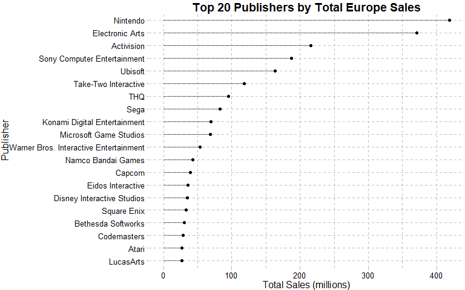

Videogame Sales Analysis
================
By Erik Cheekes

-   [1 Introduction](#1-introduction)
-   [2 The Data](#2-the-data)
-   [3 Data cleaning and
    transformation](#3-data-cleaning-and-transformation)
    -   [3.1 Missing values](#31-missing-values)
    -   [3.2 Categorical variables](#32-categorical-variables)
        -   [3.2.1 Genre](#321-genre)
        -   [3.2.2 Platform](#322-platform)
        -   [3.2.3 Publisher](#323-publisher)
        -   [3.2.4 Name](#324-name)
    -   [3.3 Numeric sales variables](#33-numeric-sales-variables)
    -   [3.4 Year](#34-year)
-   [4 Analysis](#4-analysis)
    -   [4.1 Exploring sales](#41-exploring-sales)
        -   [4.1.1 Global sales](#411-global-sales)
        -   [4.1.2 How has sales differ by
            region?](#412-how-has-sales-differ-by-region)
    -   [4.2 How has sales varied by
        genre?](#42-how-has-sales-varied-by-genre)
        -   [4.2.1 Global Sales](#421-global-sales)
        -   [4.2.2 Regional sales](#422-regional-sales)
    -   [4.3 How many unique game releases are there for each game
        genre?](#43-how-many-unique-game-releases-are-there-for-each-game-genre)
    -   [4.4 How has sales varied
        overtime?](#44-how-has-sales-varied-overtime)
        -   [4.4.1 Sales by Year](#441-sales-by-year)
        -   [4.4.2 Yearly sales by Genre](#442-yearly-sales-by-genre)
    -   [4.5 How has sales differed by
        platform?](#45-how-has-sales-differed-by-platform)
        -   [4.5.1 All platforms](#451-all-platforms)
        -   [4.5.2 Handheld and
            non-handheld](#452-handheld-and-non-handheld)
    -   [4.6 How has total sales varied by
        publisher?](#46-how-has-total-sales-varied-by-publisher)
    -   [4.7 How has total sales varied for individual game
        releases?](#47-how-has-total-sales-varied-for-individual-game-releases)
-   [5 Key points and conclusion](#5-key-points-and-conclusion)
-   [6 Limits and biases](#6-limits-and-biases)
-   [7 Future Analysis Ideas](#7-future-analysis-ideas)

# 1 Introduction

In this scenario, a fictitious company called Eludis wants to enter the
videogame market as a game developer. Eludis wants a particular dataset
analysed. Specifically, Eludis desires to understand how game sales
differ across characteristics like genre, platform, publisher, and
region. To accomplish this task I conduct an exploratory data analysis
on this dataset.

``` r
library(tidyverse)
library(readxl)
library(readr)
library(lubridate)
library(flextable) # for tables
library(skimr)     # for cleaning
library(janitor)   # for cleaning
library(treemapify) # for treemap visualisations with ggplot2
library(cowplot)   # for placing plots together
library(scales)    # Affect axis ticks easily
library(ggthemes)  # For customising ggplot plot aesthetics
```

# 2 The Data

To accomplish this analysis I used a kaggle dataset called Video Game
Sales, which can be seen
[here](https://www.kaggle.com/gregorut/videogamesales). This data was
scraped from [vgchartz.com](https://www.vgchartz.com/) by [Gregory
Smith](https://www.kaggle.com/gregorut).

After loading in the data, I examine its contents which are previewed
below.

``` r
vg_ds <- read_csv("vgsales.csv")
glimpse(vg_ds) 
```

    ## Rows: 16,598
    ## Columns: 11
    ## $ Rank         <dbl> 1, 2, 3, 4, 5, 6, 7, 8, 9, 10, 11, 12, 13, 14, 15, 16, 17~
    ## $ Name         <chr> "Wii Sports", "Super Mario Bros.", "Mario Kart Wii", "Wii~
    ## $ Platform     <chr> "Wii", "NES", "Wii", "Wii", "GB", "GB", "DS", "Wii", "Wii~
    ## $ Year         <chr> "2006", "1985", "2008", "2009", "1996", "1989", "2006", "~
    ## $ Genre        <chr> "Sports", "Platform", "Racing", "Sports", "Role-Playing",~
    ## $ Publisher    <chr> "Nintendo", "Nintendo", "Nintendo", "Nintendo", "Nintendo~
    ## $ NA_Sales     <dbl> 41.49, 29.08, 15.85, 15.75, 11.27, 23.20, 11.38, 14.03, 1~
    ## $ EU_Sales     <dbl> 29.02, 3.58, 12.88, 11.01, 8.89, 2.26, 9.23, 9.20, 7.06, ~
    ## $ JP_Sales     <dbl> 3.77, 6.81, 3.79, 3.28, 10.22, 4.22, 6.50, 2.93, 4.70, 0.~
    ## $ Other_Sales  <dbl> 8.46, 0.77, 3.31, 2.96, 1.00, 0.58, 2.90, 2.85, 2.26, 0.4~
    ## $ Global_Sales <dbl> 82.74, 40.24, 35.82, 33.00, 31.37, 30.26, 30.01, 29.02, 2~

There are 16,598 game releases spread across eleven variables. A row
number variable is added to the dataset so I can later reference and
manipulate specific observations easier.

``` r
vg_ds$row_number <- 1:nrow(vg_ds)
```

# 3 Data cleaning and transformation

Before delving into analysis, I examine each variable to identify any
potential issues that require cleaning.

## 3.1 Missing values

No rows contain any missing data.

``` r
# Count rows with missing values
sum(!complete.cases(vg_ds)) 
```

    ## [1] 0

## 3.2 Categorical variables

I briefly examine each categorical variable and ensure no misspelled or
duplicate names exist.

### 3.2.1 Genre

``` r
unique(vg_ds$Genre)
```

    ##  [1] "Sports"       "Platform"     "Racing"       "Role-Playing" "Puzzle"      
    ##  [6] "Misc"         "Shooter"      "Simulation"   "Action"       "Fighting"    
    ## [11] "Adventure"    "Strategy"

The Genre column contains 12 unique values in total with no
misspelled/duplicate names.

### 3.2.2 Platform

``` r
unique(vg_ds$Platform)
```

    ##  [1] "Wii"  "NES"  "GB"   "DS"   "X360" "PS3"  "PS2"  "SNES" "GBA"  "3DS" 
    ## [11] "PS4"  "N64"  "PS"   "XB"   "PC"   "2600" "PSP"  "XOne" "GC"   "WiiU"
    ## [21] "GEN"  "DC"   "PSV"  "SAT"  "SCD"  "WS"   "NG"   "TG16" "3DO"  "GG"  
    ## [31] "PCFX"

In total, 31 unique platform names exist in the dataset, however, the
2600 value is unclear. Conducting outside research identified this
platform as the Atari 2600. The code below changes 2600 to Atari in the
Platform column.

``` r
vg_ds$Platform[vg_ds$Platform == "2600"] <- "Atari"
```

Secondly, these platforms can be split into two broader categories,
handheld and non-handheld. Handheld platforms are game devices that are
portable. Sales may feasibly differ by this classification, hence, I
create a new variable that accounts for this broader platform
difference.

``` r
# create new column where every value is Non_handheld
vg_ds$handheld <- "Non_handheld" 
# replaces incorrect Non-handheld value with Handheld
vg_ds$handheld[vg_ds$Platform %in% c("GBA","DS","GB","GBA", "3DS", "PSP", "PSV", "WS" )] <- "Handheld"
```

### 3.2.3 Publisher

In total, there are 579 unique publishers.

``` r
nrow(as.data.frame(unique(vg_ds$Publisher)))
```

    ## [1] 579

There were no duplicates stemming from misspelled names.

### 3.2.4 Name

The Name variable has too many values to reasonably check. However, it
is possible to examine whether duplicates exist by comparing the number
of unique game names with the total rows of the dataset.

``` r
# Number of unique names
unique_names <- length(unique(vg_ds$Name))
# number of rows
rows <- nrow(vg_ds)
# Number of non-unique names
rows - unique_names
```

    ## [1] 5105

There are 5105 non-unique Name values. Multi-platform games (i.e., they
are released on multiple game consoles) may explain this. To confirm my
theory, I create a new column which combines data from the Name and
Platform variables to create a unique combination before running the
same code.

``` r
vg_ds <- vg_ds %>% 
  unite(name_platform, c("Name","Platform"), remove = FALSE)

length(unique(vg_ds$name_platform))
```

    ## [1] 16593

The above supports my suspicion, however, non-unique observations still
exist which requires further investigation. The below code identifies
these duplicate values.

``` r
# filter the dataset for these duplicate rows. 

# get_dupes a function from the janitor package, used to obtain duplicate values

dupes <- get_dupes(data.frame(vg_ds$name_platform)) 

# filter out rows containing the non-multiplatform duplicate names

check_dupes <- vg_ds %>% 
  filter(name_platform %in% unique(dupes$vg_ds.name_platform)) %>% 
  select(name_platform, row_number, NA_Sales, EU_Sales, JP_Sales, Other_Sales, Global_Sales)

check_dupes
```

    ## # A tibble: 10 x 7
    ##    name_platform  row_number NA_Sales EU_Sales JP_Sales Other_Sales Global_Sales
    ##    <chr>               <int>    <dbl>    <dbl>    <dbl>       <dbl>        <dbl>
    ##  1 Madden NFL 13~        604     2.11     0.23     0           0.22         2.56
    ##  2 Need for Spee~       1174     0.62     0.8      0.01        0.15         1.58
    ##  3 Need for Spee~       1531     1        0.17     0.02        0.1          1.29
    ##  4 Sonic the Hed~       1716     0.41     0.07     0.04        0.66         1.18
    ##  5 Sonic the Hed~       4146     0        0.48     0           0            0.48
    ##  6 Need for Spee~       5901     0.02     0.23     0           0.05         0.3 
    ##  7 Need for Spee~      11677     0        0.06     0           0.02         0.08
    ##  8 Wii de Asobu:~      14998     0        0        0.02        0            0.02
    ##  9 Wii de Asobu:~      15000     0        0        0.02        0            0.02
    ## 10 Madden NFL 13~      16128     0        0.01     0           0            0.01

These games were further researched to determine cleaning steps.

-   Need for Speed: Most Wanted was released both in 2012 and 2005 for
    PC and Xbox as separate games but with the same name, so these rows
    need no change.
-   Sonic the Hedgehog and Madden NFL 13 show different values for each
    sales variable which indicates these are different releases of the
    same games in the same year. Therefore I combine the rows for these
    two games.
-   Wii de Asobu: Metroid Prime shows duplicate values in all sales
    variables but research show only one release year, therefore, I
    delete one of these rows.

``` r
# Sum sales values for Sonic the Hedgehog_PS3 and Madden NFL 13_PS3 games

summed_sales <- check_dupes %>%
   filter(name_platform %in%(c("Sonic the Hedgehog_PS3", "Madden NFL 13_PS3"))) %>% 
   group_by(name_platform) %>%
   summarise_each(list(sum))

# Replace values from one row for each game with their respective total summed values

vg_ds[1716, 8:12] <- summed_sales[2, 3:7] # sonic game
vg_ds[604, 8:12] <- summed_sales[1, 3:7] # madden game

# Remove unwanted rows

vg_ds <- vg_ds %>% 
  filter(!(row_number %in% c(16128, 4146, 14998)))
```

Now, only duplicates in the name_platform column that remain are from
the game Need For Speed: Most Wanted (as intended).

``` r
# Check to see if dupes still exists
get_dupes(data.frame(vg_ds$name_platform))
```

    ##                vg_ds.name_platform dupe_count
    ## 1   Need for Speed: Most Wanted_PC          2
    ## 2   Need for Speed: Most Wanted_PC          2
    ## 3 Need for Speed: Most Wanted_X360          2
    ## 4 Need for Speed: Most Wanted_X360          2

``` r
# remove dupes, no longer needed
rm(dupes)
```

## 3.3 Numeric sales variables

There are four sales variables which represent regions of North America,
Europe, Japan, and a miscellaneous category called Other. A fifth
variable represents global sales which equals the sum of these other
sales variables.

I clarify that no sales value is negative (which would be a clear data
error).

``` r
# Code that counts rows with values below 0

# Global sales

nrow(vg_ds %>% 
  filter(Global_Sales < 0))
```

    ## [1] 0

``` r
# North America sales

nrow(vg_ds %>% 
  filter(NA_Sales < 0))
```

    ## [1] 0

``` r
# Europe Sales

nrow(vg_ds %>% 
  filter(EU_Sales < 0))
```

    ## [1] 0

``` r
# Japan Sales

nrow(vg_ds %>% 
  filter(JP_Sales < 0))
```

    ## [1] 0

``` r
# Other Sales

nrow(vg_ds %>% 
  filter(Other_Sales < 0))
```

    ## [1] 0

## 3.4 Year

Finally, I examine the year variable.

``` r
unique(vg_ds$Year)
```

    ##  [1] "2006" "1985" "2008" "2009" "1996" "1989" "1984" "2005" "1999" "2007"
    ## [11] "2010" "2013" "2004" "1990" "1988" "2002" "2001" "2011" "1998" "2015"
    ## [21] "2012" "2014" "1992" "1997" "1993" "1994" "1982" "2003" "1986" "2000"
    ## [31] "N/A"  "1995" "2016" "1991" "1981" "1987" "1980" "1983" "2020" "2017"

Three issues exist with the Year variable:

-   The variable data type is character so I convert it to a more
    appropriate data type.
-   Missing values do exist in the dataset as represented by the 271
    “N/A” values in the Year column. I convert these “N/A” values to NA
    (the appropriate R data type for missing variables).
-   No game released after 2016 should be in the data (as this is when
    the original dataset was collected). Thus these games are
    investigated and appropriate dates supplied.

``` r
# Convert "N/A" to NA

vg_ds$Year[vg_ds$Year == "N/A"] <- NA 

# Change character to integer (which is suitable for the purposes of this analysis)

vg_ds$Year <- as.integer(vg_ds$Year)

# Identify games with years over 2016

filter(vg_ds, Year == 2020 | Year == 2017)
```

    ## # A tibble: 4 x 14
    ##    Rank name_platform     Name  Platform  Year Genre Publisher NA_Sales EU_Sales
    ##   <dbl> <chr>             <chr> <chr>    <int> <chr> <chr>        <dbl>    <dbl>
    ## 1  5959 Imagine: Makeup ~ Imag~ DS        2020 Simu~ Ubisoft       0.27        0
    ## 2 14393 Phantasy Star On~ Phan~ PS4       2017 Role~ Sega          0           0
    ## 3 16244 Phantasy Star On~ Phan~ PSV       2017 Role~ Sega          0           0
    ## 4 16441 Brothers Conflic~ Brot~ PSV       2017 Acti~ Idea Fac~     0           0
    ## # ... with 5 more variables: JP_Sales <dbl>, Other_Sales <dbl>,
    ## #   Global_Sales <dbl>, row_number <int>, handheld <chr>

``` r
# Change their values to appropriate years

vg_ds$Year[vg_ds$Name == "Imagine: Makeup Artist"] <- 2009
vg_ds$Year[vg_ds$Name == "Phantasy Star Online 2 Episode 4: Deluxe Package"] <- 2016
vg_ds$Year[vg_ds$Name == "Brothers Conflict: Precious Baby"] <- 2016
```

# 4 Analysis

In the following sections I analyse the dataset with a particular focus
on the sales variables as per Eludis’s request.

## 4.1 Exploring sales

An important point to note is the values for all sales variables are in
the millions.

### 4.1.1 Global sales

``` r
# Function to calculate summary statistics on numeric value

quant.indv.stats.sum <- function(data, depvar) {data %>% 
    summarize(Mean = mean({{depvar}}, na.rm = TRUE), Median = median({{depvar}}, na.rm = TRUE),  Std = sd({{depvar}}), IQR = IQR({{depvar}}), "Quartile 1" = quantile({{depvar}}, probs = 0.25), 
              "Quartile 3" = quantile({{depvar}}, probs = 0.75), Min = min({{depvar}}), Max = max({{depvar}}))
}

# Apply function to data

global_sales_statistics <- quant.indv.stats.sum(vg_ds, Global_Sales)

global_sales_statistics
```

    ## # A tibble: 1 x 8
    ##    Mean Median   Std   IQR `Quartile 1` `Quartile 3`   Min   Max
    ##   <dbl>  <dbl> <dbl> <dbl>        <dbl>        <dbl> <dbl> <dbl>
    ## 1 0.538   0.17  1.56  0.41         0.06         0.47  0.01  82.7

-   The mean being far higher than the median indicates there are games
    with unusually high sales which raise the mean.
-   The IQR is a better indicator of variability (in this case) than the
    standard deviation as it is less susceptible to the influence of
    high values. The IQR indicate 50% of game releases made sales
    between 60,000 and 470,000, while 25% made lower than the former and
    25% made higher than the latter.
-   The max and min values show a wide range of sales values exist.

The graph below visualises the distribution of the Global Sales
variable.

``` r
# Histogram of Global_Sales

ggplot(vg_ds, mapping = aes(x = Global_Sales)) +
  geom_histogram(binwidth = 1) +
  labs(title = "Game Sales", x = "Sales (in millions)", y = "Count")
```

<!-- -->

-   Vast majority of games made under 5 million sales.
-   Existence of a relatively few number of games with high sales are
    shown.
-   Particularly high sales (such as Wii Sports 82.74 million sales)
    exist but are too infrequent to show on the graph.

### 4.1.2 How has sales differ by region?

Of interest is whether sales differ regionally. Rather than employing
clunky tables for each region, I visualise the median, mean, IQR, and
total sum for each region to make comparison clearer.

``` r
# function to create a lollipop chart which will be used to visualise the sales data

lol_plot_bivariate <- function(data, xvar, yvar, name = waiver(), xname = waiver(), yname = waiver(), ticks = 5, 
                              line_alpha = 0.5, xlabs_tilt = 0){
  ggplot(data, aes(x = reorder({{xvar}}, {{yvar}}), y = {{yvar}})) + #reorder() orders values by value
    geom_point() + 
    geom_segment(aes(x = {{xvar}}, xend = {{xvar}}, y = 0, yend = {{yvar}}), alpha = line_alpha) +
    scale_y_continuous(breaks = pretty_breaks(n = ticks)) +
    labs(title = name) +
    xlab(xname) +
    ylab(yname) +
    theme(axis.text.x = element_text(angle = xlabs_tilt)) #hjust is horizontal justification
}
```

``` r
# Create data frame with median sales for each region and then make wide
# data long

median_regional_sales <- vg_ds %>% 
    select(NA_Sales, EU_Sales, JP_Sales, Other_Sales) %>% 
    summarise(across(everything(), median, na.rm = TRUE)) %>% 
    gather(key = "Region", value = "Sales") # make data long

# applying bar plot function

lol_plot_bivariate(median_regional_sales, xvar = Region, yvar = Sales, yname = "Median Sales (in millions)" , xname = "Region", name = "Median Sales by Region") +   theme(axis.title.y = element_text(vjust= 1.2)) 
```

<!-- -->

-   Median sales is far higher in North America than the other regions
-   Japan’s median value is zero as a high proportion of game releases
    in the dataset show zero sales in the region.

``` r
# Visualise and compare mean sales by region

mean_regional_sales <- vg_ds %>% 
    select(NA_Sales, EU_Sales, JP_Sales, Other_Sales) %>% 
    summarise(across(everything(), mean, na.rm = TRUE)) %>% 
    gather(key = "Region", value = "Sales")

# applying bar plot function

lol_plot_bivariate(mean_regional_sales, xvar = Region, yvar = Sales, yname = "Mean Sales (in millions)" , xname = "Region", name = "Mean Sales by Region")
```

<!-- -->

-   North America and Europe still retain the top two spots for sales
    when considering the mean.
-   Japan show a higher mean sales than the Other sales category.

``` r
# Visualise and compare IQR by region

IQR_regional_sales <- vg_ds %>% 
    select(NA_Sales, EU_Sales, JP_Sales, Other_Sales) %>% 
    summarise(across(everything(), IQR, na.rm = TRUE)) %>% 
    gather(key = "Region", value = "IQR")

# applying bar plot function

lol_plot_bivariate(IQR_regional_sales, xvar = Region, yvar = IQR, xname = "Region", yname = "IQR", "Variability of Regional Sales (IQR in millions)")
```

<!-- -->

-   North American sales varies the most.
-   Japan and Other sales varies the least.

Lastly, lets consider total sales by region.

``` r
sum_regional_sales <- vg_ds %>% 
    select(NA_Sales, EU_Sales, JP_Sales, Other_Sales) %>% 
    summarise(across(everything(), sum, na.rm = TRUE)) %>% 
    gather(key = "Region", value = "sum")

# applying bar plot function

lol_plot_bivariate(sum_regional_sales, xvar = Region, yvar = sum, xname = "Region", yname = "Total Sales (in millions)", name = "Total Sales by Region (in millions)")
```

<!-- -->

-   North America has the highest total sales.
-   Other category has the least total sales.

## 4.2 How has sales varied by genre?

Analysis splits between global and regional sales.

### 4.2.1 Global Sales

First lets examine total, mean, and median sales for each genre.

``` r
ct_global_sales_statistics <- vg_ds %>% 
  group_by(Genre) %>% 
  summarise(Total = sum(Global_Sales), Mean = mean(Global_Sales), Median = median(Global_Sales)) %>% 
  arrange(-Total)

ct_global_sales_statistics
```

    ## # A tibble: 12 x 4
    ##    Genre        Total  Mean Median
    ##    <chr>        <dbl> <dbl>  <dbl>
    ##  1 Action       1751. 0.528  0.19 
    ##  2 Sports       1331. 0.568  0.22 
    ##  3 Shooter      1037. 0.792  0.23 
    ##  4 Role-Playing  927. 0.623  0.185
    ##  5 Platform      831. 0.939  0.28 
    ##  6 Misc          810. 0.466  0.16 
    ##  7 Racing        732. 0.586  0.19 
    ##  8 Fighting      449. 0.529  0.21 
    ##  9 Simulation    392. 0.452  0.16 
    ## 10 Puzzle        245. 0.421  0.11 
    ## 11 Adventure     239. 0.186  0.06 
    ## 12 Strategy      175. 0.257  0.09

-   The median being lower than the mean indicates each genre has
    certain game releases that have a relatively high amount of sales.
-   Clear differences in total, mean, and median sales by genre.

To make spotting differences in average sales by genre easier I
visualise the data below.

``` r
# Median Genre Price

lol_plot_bivariate(ct_global_sales_statistics, xvar = Genre, yvar = Median, xname = "Genre", yname = "Median Price (in millions)", name = "Median Game Genre by Sales") + coord_flip() + theme(axis.title.y = element_text(vjust= 1)) #shift Genre x axis title to the left
```

<!-- -->

``` r
# Mean Genre Price

lol_plot_bivariate(ct_global_sales_statistics, xvar = Genre, yvar = Mean, xname = "Genre", yname = "Mean Price (in millions)", name = "Mean Game Genre Price") + coord_flip()
```

<!-- -->

Also of interest is how much global sales vary for each genre. As
previous analysis identified the influence of high values, the IQR
(interquartile range) is used as it is less susceptible to extreme
values.

``` r
var_global_sales_statistics <- vg_ds %>% 
  group_by(Genre) %>% 
  summarise(IQR = IQR(Global_Sales), "Quartile 1" =    quantile(Global_Sales, probs = 0.25), 
              "Quartile 3" = quantile(Global_Sales, probs = 0.75)) %>% 
  arrange(-IQR)


var_global_sales_statistics
```

    ## # A tibble: 12 x 4
    ##    Genre          IQR `Quartile 1` `Quartile 3`
    ##    <chr>        <dbl>        <dbl>        <dbl>
    ##  1 Platform     0.7           0.09        0.79 
    ##  2 Shooter      0.65          0.08        0.73 
    ##  3 Sports       0.47          0.09        0.56 
    ##  4 Fighting     0.47          0.08        0.55 
    ##  5 Racing       0.46          0.07        0.53 
    ##  6 Role-Playing 0.452         0.07        0.522
    ##  7 Action       0.43          0.07        0.5  
    ##  8 Simulation   0.37          0.05        0.42 
    ##  9 Misc         0.35          0.06        0.41 
    ## 10 Puzzle       0.268         0.04        0.308
    ## 11 Strategy     0.23          0.04        0.27 
    ## 12 Adventure    0.14          0.02        0.16

-   Clear differences in the IQR, and thus variability, in sales for
    different genres.
-   Also clear are certain game genres, even when considering their
    variability, tend to be make more sales when considering their first
    quartile (i.e., the 25th percentile value) is higher.

Below I visualise the IQR for each genre to make spotting differences
easier.

``` r
lol_plot_bivariate(var_global_sales_statistics, xvar = Genre, yvar = IQR, xname = "Genre", name = "Interquartile Range of Global Sales") + coord_flip() + theme(axis.title.y = element_text(vjust= 1)) #shift Genre x axis title to the left)
```

<!-- -->

### 4.2.2 Regional sales

The below visualisation shows median sales by region for each specific
game genre.

``` r
#Calculate median sales for each genre by region

gs_by_genre <- vg_ds %>% 
  group_by(Genre) %>% 
  summarise(NA_Sales = median(NA_Sales), EU_Sales = median(EU_Sales),
            JP_Sales = median(JP_Sales), Other_Sales = median(Other_Sales))

#Make dataframe long so can facet wrap visualisation easier

gs_by_genre <- gs_by_genre %>% gather(Region, Median_Sales, NA_Sales:Other_Sales)

#Facet wrap the data so each plot focuses on one game genre

base <- ggplot(gs_by_genre, aes(Region, Median_Sales, color = Region)) + 
  geom_point() +
  labs(title = "Regional Median Sales by Genre") +
  ylab("Median Sales (in millions)") +
  theme(axis.text.x=element_blank(), axis.title.x = element_blank()) +
  theme_gray()
  

base + facet_wrap(~Genre, ncol = 3)
```

<!-- -->

-   Several genres show noticeably different median sales depending on
    region, such as Platform in North America.
-   Game genres tended to generate relatively high median profits in
    North America with exception in strategy and adventure games.

The below visualisation is identical except it shows mean sales rather
than median.

``` r
#Calculate mean sales for each genre by region

gs_by_genre <- vg_ds %>% 
  group_by(Genre) %>% 
  summarise(NA_Sales = mean(NA_Sales), EU_Sales = mean(EU_Sales),
            JP_Sales = mean(JP_Sales), Other_Sales = mean(Other_Sales))

#Make dataframe long so can facet wrap visualisation easier

gs_by_genre <- gs_by_genre %>% gather(Region, Mean_Sales, NA_Sales:Other_Sales)

#Facet wrap the data so each plot focuses on one game genre

base <- ggplot(gs_by_genre, aes(Region, Mean_Sales, color = Region)) + 
  geom_point() +
  labs(title = "Regional Mean Sales by Genre") +
  ylab("Mean Sales (in millions)") +
  theme(axis.text.x=element_blank(), axis.title.x = element_blank()) +
  theme_gray()
  

base + facet_wrap(~Genre, ncol = 3)
```

<!-- -->

-   Again, North America maintains its dominance as consistently having
    the highest average sales in most game genres.

## 4.3 How many unique game releases are there for each game genre?

The below code accounts for multi-platform games (i.e., a game is only
counted once even if released on multiple consoles).

``` r
# Count number of unique game releases in each genre

unique_genre_count <- vg_ds %>% 
  select(Genre, name_platform) %>% 
  distinct() %>% # obtain unique rows
  count(Genre) %>% # count number of rows in each genre
  rename(Count = n) %>% #rename n column to count
  arrange(-Count)


#Visualise with a lollipop chart

lol_plot_bivariate(unique_genre_count, Genre, Count, xname = "Genre", yname = "Releases", name = "Unique Game Releases by Genre") + coord_flip()
```

<!-- -->

-   Excluding the Misc category, Action, Sports, and Role-Playing were
    the most commonly released game genres during the examined time
    period.
-   The least common were Platform, Fighting, and Racing.

The below code visualises game genre releases overtime. Each dot
represents the specific number of releases for each genre per year while
the lines indicate the overall trend.

``` r
# Count number of game releases by genre for each year while excluding missing values

unique_genre_count_year <- vg_ds %>% 
  select(Year, Genre, Name) %>% 
  distinct() %>% 
  group_by(Year, Genre) %>% 
  summarise(count = n()) %>% 
  na.exclude()

# My own function to produce a scatterplot with trend lines.

scatter <- function(data, xvar, yvar, ..., name = waiver(), xname = waiver(), yname = waiver(),
                    xticks = 5, yticks = 5) {
  ggplot(data = data, aes(x = {{xvar}}, y = {{yvar}}, color = ..., shape = ...)) + 
    geom_point() +
    geom_smooth(se = FALSE) +
    scale_x_continuous(breaks = pretty_breaks(n = xticks)) +
    scale_y_continuous(breaks = pretty_breaks(n = yticks)) +
    labs(title = name) +
    xlab(xname) +
    ylab(yname)
}

# Applying scatterplot function

scatter(unique_genre_count_year, xvar = Year, yvar = count, color = Genre, yname = "Releases", name = "Game Genre Releases per Year") 
```

<!-- -->

-   All genres follow a similar pattern where releases are relatively
    low prior to 1995 before rising and peaking around the mid-late
    2000s before decreasing until early 2016.
-   Also illustrated are the various differences in the total sum of
    releases for each genre in each year.

It is difficult to focus in on specific genres in the above graph,
therefore, the visualisation below separates out each genre
individually.

``` r
base <- ggplot(unique_genre_count_year, aes(Year, count)) + 
  geom_point() +
  geom_smooth(se = FALSE) +
  ylab("Total Unique Game Releases") +
  labs(title = "Game Genre Releases by Year") +
  theme_gray()
  

base + facet_wrap(~Genre, ncol = 3)
```

<!-- -->

## 4.4 How has sales varied overtime?

### 4.4.1 Sales by Year

Lets first examine only sales and the time variable

``` r
# Calculate total sum for each year by region. This involves making the data into long format so we can later visualise each region on separate plots.

sales_by_year <- vg_ds %>% 
  select(Year, Global_Sales, NA_Sales, EU_Sales, JP_Sales, Other_Sales) %>% 
  group_by(Year) %>% 
  summarise_each(list(sum)) %>% 
  gather(Region, Total_Sales, Global_Sales:Other_Sales)


base <- ggplot(sales_by_year, aes(Year, Total_Sales)) + 
  geom_point() +
  geom_smooth(se = FALSE) +
  ylab("Yearly Total Sales (in millions)") +
  labs(title = "Total Year Sales by Region") +
  theme_gray()
  

base + facet_wrap(~Region, ncol = 3)
```

<!-- -->

-   Japan and Other sales show relatively little change in yearly total
    sales compared to North America and Europe.
-   A clear curve is seen during the 2000s which is most pronounced for
    Global, North American, and European sales.

### 4.4.2 Yearly sales by Genre

Lets first examine total yearly global sales by genre.

``` r
#Calcuate median sales by year for each genre
yearly_sales_total <- vg_ds %>% 
  group_by(Year, Genre) %>% 
  summarise(Total_Sales = sum(Global_Sales))

#Visualise
scatter(yearly_sales_total, xvar = Year, yvar = Total_Sales, color = Genre, yname = "Total Sales (in millions)", name = "Yearly Total Sales by Genre")
```

<!-- -->

-   Most genres show a clear rising trend in total sales from 1995 to
    the mid-late 2000s.
-   Around the mid-late 2000s all genres started showing average yearly
    decreases before a decreasing trend in the 2010s.

It is difficult to differentiate between genres in the above graph, so
the graph below visualises each specific genre on its own which
simplifies examining each genre’s individual trend.

``` r
#Facet wrap the data so each plot focuses on one game genre

base <- ggplot(yearly_sales_total, aes(Year, Total_Sales)) + 
  geom_point() +
  geom_smooth(se = FALSE) +
  ylab("Total Sales (in millions)") +
  theme_gray()
  

base + facet_wrap(~Genre, ncol = 3)
```

<!-- -->

-   It is clear that the large peak in total sales comes mainly from
    certain genres (Action, Misc, Simulation, Racing, Shooter, and
    Sports).
-   Certain genres show relatively little change in total sales, such as
    the Strategy and Platform genres.

Next, lets examine average sales. The median is used as it is less
influenced by unusually high values.

``` r
#Calcuate median sales by year for each genre
yearly_sales_median <- vg_ds %>% 
  group_by(Year, Genre) %>% 
  summarise(Median_Sales = median(Global_Sales))

#Visualise
scatter(yearly_sales_median, xvar = Year, yvar = Median_Sales, color = Genre, yname = "Median Sales (in millions)", name = "Yearly Median Sales by Genre")
```

<!-- -->

-   Median sales tended to be far higher prior to 1995.

Interestingly, the trends seen across time for median sales is opposite
to that of total sales and unique game releases (the latter was seen
earlier in a graph during section 4.3). Consequently, these three
visualisations indicate average sales per game genre decreased from 1995
due to increases in the number of games released for each genre. In
other words, the increase in games released was not equally matched by
an increase in sales so sales became relatively more spread out across a
wider selection of games.

The graph below visualises the median sales for each specific genre on
its own to make exploring the individual trend for each genre easier.

``` r
base <- ggplot(yearly_sales_median, aes(Year, Median_Sales)) + 
  geom_point() +
  geom_smooth(se = FALSE) +
  ylab("Median Sales (in millions)") +
  labs(title = "Median Yearly Sales by Genre") +
  theme_gray()
  

base + facet_wrap(~Genre, ncol = 3)
```

<!-- -->

## 4.5 How has sales differed by platform?

This analysis splits between considering all platforms before
considering differences in sales by whether the platform is handheld or
not.

### 4.5.1 All platforms

The below graph plots total sales by platform.

``` r
# Calculate total sales by genre for each platform

total_profit_platform <- vg_ds %>% 
          group_by(Platform) %>% 
          summarise(Total_Profit = sum(Global_Sales)) 
         
#My own function for a bar chart

multi_bar_stacked <- function(data, xvar, sec_var, ..., name = waiver(), xname = waiver(), yname = waiver(), ticks = 5,
                                               show_numbers = FALSE) {
  #This function produces a multi_bar_stacked and lets you choose whether to show numbers or not
  if(show_numbers == TRUE) {#then construct multi_bar_stack with numbers on each column
  ggplot(data, aes(x = reorder({{xvar}}, {{sec_var}}), y = {{sec_var}}, fill = ..., label = {{sec_var}})) + #label selects values to display
    geom_col() +
    scale_y_continuous(breaks = pretty_breaks(n = ticks)) +
    labs(title = name) +
    xlab(xname) +
    ylab(yname) + #geom_text lets you put numbers on
    geom_text(size = 3, position = position_stack(vjust = 0.5))}else{
      
      #do not construct multi_bar_stack with numbers on each column
      
      ggplot(data, aes(x = reorder({{xvar}}, {{sec_var}}), y = {{sec_var}}, fill = ...)) + 
        geom_col() +
        scale_y_continuous(breaks = pretty_breaks(n = ticks)) +
        labs(title = name) +
        xlab(xname) +
        ylab(yname)
    }
}

# apply bar chart

multi_bar_stacked(total_profit_platform, Platform, Total_Profit, xname = "Platform", yname = "Total Sales (in millions)", name = "Total Sales by Platform") + coord_flip() + theme_gray()
```

<!-- -->

-   Clear differences exist in total profit by each platform.
-   Different platforms have seen far more sales from games releases
    than others.

Now lets examine the median sales for each platform.

``` r
# Calculate median sales by genre for each platform

median_profit_platform <- vg_ds %>% 
          group_by(Platform) %>% 
          summarise(Median_Profit = median(Global_Sales)) 
         

multi_bar_stacked(median_profit_platform, Platform, Median_Profit, xname = "Platform", yname = "Median Sales (in millions)", name = "Median Sales by Platform") + coord_flip() + theme_gray()
```

<!-- -->

-   Clear differences exist in median sales for each platform.

### 4.5.2 Handheld and non-handheld

As discussed earlier, a key distinction in videogame platforms are
whether they are handheld (in other words, functionally portable) or
non-handheld. The handheld variable created earlier can be used to
explore how sales differ by this characteristic.

Firstly, I examine the quantity of unique games released for each
category.

``` r
handheld_count <- vg_ds %>% 
  select(Genre, name_platform, handheld) %>% 
  distinct() %>% 
  count(handheld) %>% 
  rename(Amount = n) %>% # rename n column to count
  mutate(Percentage = round(Amount/sum(Amount) * 100))  # calculate percentage

handheld_count
```

    ## # A tibble: 2 x 3
    ##   handheld     Amount Percentage
    ##   <chr>         <int>      <dbl>
    ## 1 Handheld       5224         31
    ## 2 Non_handheld  11369         69

-   Non-handheld game release are far more common, constituting roughly
    61% of the games examined.

Below shows summary statistics on global sales for both handheld and
non-handheld platforms.

``` r
handheld_summary_stats <- vg_ds %>% # dataframe summary stats by handheld or not
  group_by(handheld) %>% 
  summarise(Total = sum(Global_Sales), Mean = mean(Global_Sales), Median = median(Global_Sales),
            Std = sd(Global_Sales), IQR = IQR(Global_Sales), Highest = max(Global_Sales))
  

handheld_summary_stats
```

    ## # A tibble: 2 x 7
    ##   handheld     Total  Mean Median   Std   IQR Highest
    ##   <chr>        <dbl> <dbl>  <dbl> <dbl> <dbl>   <dbl>
    ## 1 Handheld     2004. 0.384   0.11  1.37  0.25    31.4
    ## 2 Non_handheld 6917. 0.608   0.21  1.63  0.49    82.7

-   Non-handheld saw, on average, for both the mean and median, more
    sales per game than handheld.
-   Total sales are higher for non-handheld platforms.
-   The standard deviation and IQR indicate sales from non-handheld
    platforms vary more.

The graph below compared median sales for handheld and non-handheld
games by genre.

``` r
handheld_genre_summary_stats <- vg_ds %>% #by genre and handheld 
  group_by(Genre, handheld) %>% 
  summarise(Count = n(),Average_sales = median(Global_Sales))
```

``` r
# Calculate media sales for handheld and non-handheld platforms by genre

handheld_genre_summary_stats <- vg_ds %>% #by genre and handheld 
  group_by(Genre, handheld) %>% 
  summarise(Count = n(),Average_sales = median(Global_Sales))

# Visualise median sales

handheld_genre_scatter  <- ggplot(handheld_genre_summary_stats, mapping = aes(x = Genre, y = Average_sales, color = handheld)) +
  geom_point(size = 2) +
  theme(axis.text.x = element_text(angle = 20)) +
  theme(axis.title.y = element_text(vjust= 1)) +
  labs(title = "Median Sales by Handheld", y = "Median Sales (in millions)", color = "Handheld?") +
  scale_color_discrete(labels = c("Yes", "No"))

handheld_genre_scatter
```

<!-- -->

-   Median non-handheld sales were on average higher for all categories
    barring strategy and puzzle.
-   The difference between median sales for the Shooter genre is the
    most extreme.

## 4.6 How has total sales varied by publisher?

The graph below visualises the distribution of total sales for game
publishers.

``` r
# Sum up total sales for each publisher for global and regional sales

total_sales_publisher <- vg_ds %>% 
  group_by(Publisher) %>% 
  summarise(Global_Sales = sum(Global_Sales), NA_Sales = sum(NA_Sales), EU_Sales = sum(EU_Sales), JP_Sales = sum(JP_Sales), Other_Sales = sum(Other_Sales))

# My own function for a histogram and its customisation

histo <- function(data, xcolumn, ..., ticks = 5, xmin = NULL, xmax = NULL,
                  ymin = NULL, ymax = NULL, name = waiver(),xname = waiver(), 
                  yname = waiver(), fig.caption = NULL) {
  # xmin = low x axis zoom limit, xmax = upper ex axis zoom limit
  # yl and yu mean similar
  ggplot(data = data, aes(x = {{xcolumn}})) +
    geom_histogram(binwidth = ...) +
    scale_x_continuous(breaks = pretty_breaks(n = ticks)) + 
    coord_cartesian(xlim = c(xmin, xmax), ylim = c(ymin, ymax)) +
    labs(title = name, caption = fig.caption ) +
    theme(plot.caption.position = "plot", #sets position of caption
          plot.caption = element_text(hjust = 0)) +
    xlab(xname) +
    ylab(yname)
}

# Apply histo function to visualise the publisher total sales

histo(total_sales_publisher, Global_Sales, ticks = 10, xname = "Total Sales", yname = "Publisher Count", name = "Total Sales by Publisher (in millions)", binwidth = 30) + theme(axis.title.y = element_text(vjust= 1))
```

<!-- -->

-   Clear that a small number of publishers are associated with a
    disproportionately large amount of sales.
-   The vast majority of publishers have not seen over 100 million in
    sales.

Lets take a closer look at publishers who are under 100 million in
sales.

``` r
total_sales_publisher %>% 
  filter(Global_Sales < 100) %>% 
  histo(Global_Sales, ticks = 10, xname = "Total Sales (in millions)", yname = "Publisher Count", name = "Total Sales by Publisher", binwidth = 1) + theme(axis.title.y = element_text(vjust= 1))
```

<!-- -->

-   Most publishers see under a million in sales.

Lets identify the specific publishers that see the highest global sales.

``` r
# Visualise top 20 publishers by sales

total_sales_publisher %>% 
  slice_max(Global_Sales, n = 20) %>% 
  lol_plot_bivariate(Publisher, Global_Sales, xname = "Publisher", yname = "Total Sales (millions)", name = "Top 20 Publishers by Total Global Sales") + coord_flip()
```

<!-- -->

-   Nintendo, by far, see the highest total sales from their published
    games, which is followed by Electronic Arts and Activision
-   All other publishers saw under 1000 million in sales.

Lets repeat the above for each region to see whether top publishers
differ.

``` r
total_sales_publisher %>% 
  slice_max(NA_Sales, n = 20) %>% 
  lol_plot_bivariate(Publisher, NA_Sales, xname = "Publisher", yname = "Total Sales (millions)", name = "Top 20 Publishers by Total North American Sales") + coord_flip() + theme(axis.title.y = element_text(vjust= 1))
```

<!-- -->

``` r
total_sales_publisher %>% 
  slice_max(EU_Sales, n = 20) %>% 
  lol_plot_bivariate(Publisher, EU_Sales, xname = "Publisher", yname = "Total Sales (millions)", name = "Top 20 Publishers by Total Europe Sales") + coord_flip() + theme(axis.title.y = element_text(vjust= 1))
```

<!-- -->

``` r
total_sales_publisher %>% 
  slice_max(JP_Sales, n = 20) %>% 
  lol_plot_bivariate(Publisher, JP_Sales, xname = "Publisher", yname = "Total Sales (millions)", name = "Top 20 Publishers by Total Japan Sales") + coord_flip()
```

<!-- -->

``` r
total_sales_publisher %>% 
  slice_max(Other_Sales, n = 20) %>% 
  lol_plot_bivariate(Publisher, Other_Sales, xname = "Publisher", yname = "Total Sales (millions)", name = "Top 20 Publishers by Total Other Sales") + coord_flip() + theme(axis.title.y = element_text(vjust= 1.2))
```

<!-- -->

-   Nintendo, Sony Computer Entertainment, Activision, Electronic Arts,
    and Ubisoft tend to be in top 5-8 rankings by total sales.
-   Regional differences exist, in particular, positions to the latter
    end of the top 20 ten to vary more by region than higher ranked
    positions.

## 4.7 How has total sales varied for individual game releases?

The graph below visualises the distribution of total sales for the Name
variable (i.e., individual game releases).

``` r
# Sum up total sales for each Name for global and regional sales.
# This also combines any multiplatform games in the same row.


total_sales_Name <- vg_ds %>% 
  group_by(Name) %>% 
  summarise(Global_Sales = sum(Global_Sales), NA_Sales = sum(NA_Sales), EU_Sales = sum(EU_Sales), JP_Sales = sum(JP_Sales), Other_Sales = sum(Other_Sales))

# Apply histo function

histo(total_sales_Name, Global_Sales, ticks = 10, xname = "Total Sales (millions)", yname = "Game Releases", name = "Total Sales of Individual Games", binwidth = 1) + theme(axis.title.y = element_text(vjust= 1.2))
```

<!-- -->

-   Clear that a small number of games see a disproportionately large
    amount of sales.
-   The vast majority of game releases have not made over 10 million in
    sales.

Lets take a close look at the games that made 10 million or less.

``` r
total_sales_Name %>% 
  filter(Global_Sales <= 10) %>% 
  histo(Global_Sales, ticks = 10, xname = "Total Sales (in millions)", yname = "Count", name = "Total Sales of Individual Games (under one million)", binwidth = 0.1)
```

<!-- -->

-   Most games made under 1 million in sales.

Lets identify the games that see the highest global sales.

``` r
total_sales_Name %>% 
  slice_max(Global_Sales, n = 20) %>% 
  lol_plot_bivariate(Name, Global_Sales, xname = "Games", yname = "Total Sales (millions)", name = "Top 20 Games by Total Global Sales") + coord_flip()
```

<!-- -->

-   Wii sports shows a clear lead in sales compared to the other games,
    followed by Grand Theft Auto V.
-   Certain game series are consistently represented in the top 20, such
    as the Grand Theft Auto and Call of Duty series.

Lets repeat the above for each region to see whether it differs
regionally.

``` r
total_sales_Name %>% 
  slice_max(NA_Sales, n = 20) %>% 
  lol_plot_bivariate(Name, NA_Sales, xname = "Game", yname = "Total Sales (millions)", name = "Top 20 Names by Total North American Sales") + coord_flip() + theme(axis.title.y = element_text(vjust= 1.2))
```

<!-- -->

``` r
total_sales_Name %>% 
  slice_max(EU_Sales, n = 20) %>% 
  lol_plot_bivariate(Name, EU_Sales, xname = "Game", yname = "Total Sales (millions)", name = "Top 20 Games by Total Europe Sales") + coord_flip()
```

<!-- -->

``` r
total_sales_Name %>% 
  slice_max(JP_Sales, n = 20) %>% 
  lol_plot_bivariate(Name, JP_Sales, xname = "Game", yname = "Total Sales (millions)", name = "Top 20 Games by Total Japan Sales") + coord_flip() 
```

<!-- -->

``` r
total_sales_Name %>% 
  slice_max(Other_Sales, n = 20) %>% 
  lol_plot_bivariate(Name, Other_Sales, xname = "Game", yname = "Total Sales (millions)", name = "Top 20 Games by Total Other Sales") + coord_flip() + theme(axis.title.y = element_text(vjust= 1.2))
```

<!-- -->

-   Certain games and series are consistently in the top 20 (such as
    Grand Theft Auto, Wii Sports, and Call of Duty)
-   Clear regional differences also exist, For example:
    -   Only Europe and the Other category see the Fifa series in the
        top 20 list.
    -   Japan has relatively many games which are not in the top 20 for
        any of the other regions.

# 5 Key points and conclusion

This analysis has explored how video game sales varied between 1980-2016
by key characteristics. Important findings include:

-   Clear differences in regional sales, notably, North America tended
    to have the highest sales (both in total and average).
-   Game genres varied considerably in total and average sales.
-   Total sales increased between 1980-2016 whilst average sales per
    game decreased (likely due to increases in the amount of unique
    games released).
-   Non-handheld platforms showed higher total and average sales than
    handheld.
-   Most publishers saw under 50 million sales.
-   Most games made under 1 million sales.

# 6 Limits and biases

Important to consider a number of limits stemming from the dataset used.

-   Only games which sold 100,000 or more copies are in the dataset (as
    described the data collector).
-   Only games up to 2016 are considered meaning the trends between
    2017-2022 are not covered and this also means the most recent
    generation of game platforms are unaccounted for.
-   No information on mobile games (i.e., games played on mobile
    phones).
-   While there is a Other category for region, it is unclear what
    specific parts of the world this refers to.

# 7 Future Analysis Ideas

There are several potential ideas Eludis may wish consider in the future
as they continue planning their steps to become a videogame developer.

-   A comparable analysis on games released after 2016 would provide
    timelier insights into more recent trends.
-   Collecting and incorporating data such as profit and costs for each
    game would allow analysis of the profitability of game genres which
    may prove useful for Eludis’s business strategy.
-   Collection and analysis of similar data for mobile games.
